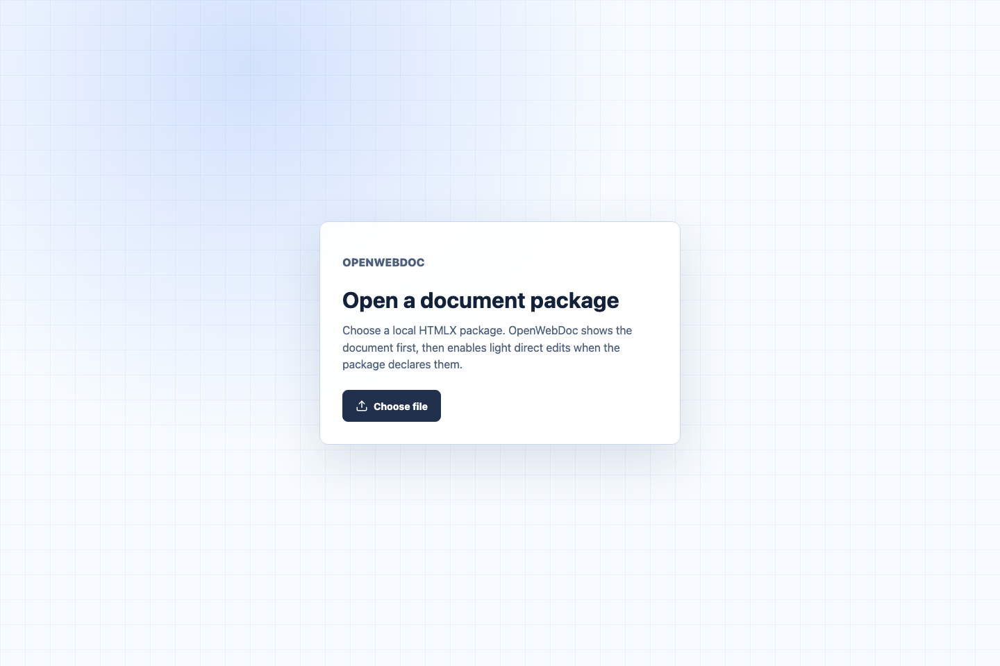
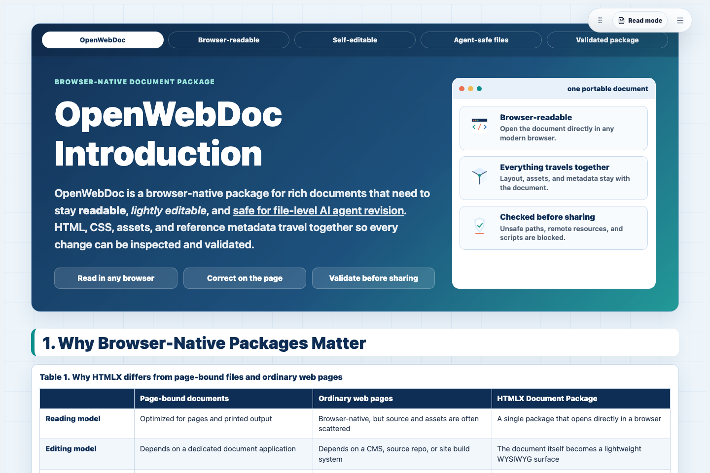
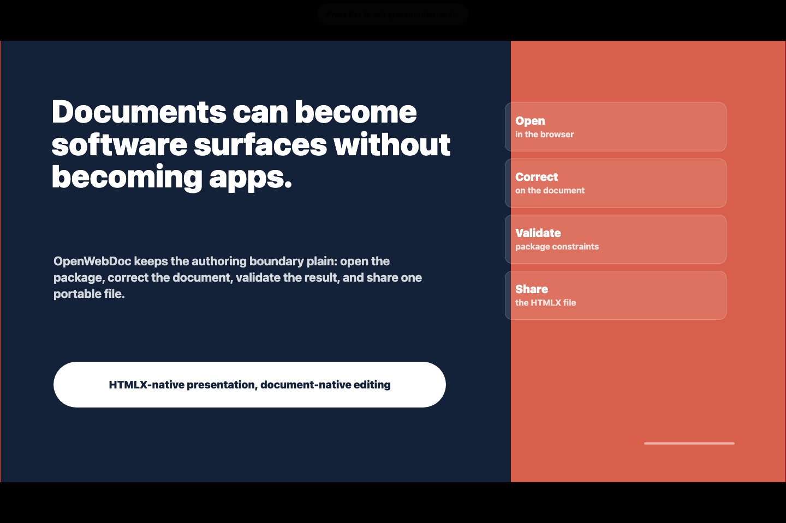

# OpenWebDoc

- [한국어](docs/i18n/README.ko.md)
- [日本語](docs/i18n/README.ja.md)
- [简体中文](docs/i18n/README.zh-Hans.md)
- [Español](docs/i18n/README.es.md)
- [Français](docs/i18n/README.fr.md)
- [Deutsch](docs/i18n/README.de.md)
- [Português do Brasil](docs/i18n/README.pt-BR.md)
- [Tiếng Việt](docs/i18n/README.vi.md)
- [Bahasa Indonesia](docs/i18n/README.id.md)
- [हिन्दी](docs/i18n/README.hi.md)

OpenWebDoc is a TypeScript monorepo for the HTMLX Document Package format. HTMLX packages are `.htmlx` ZIP files built around browser-readable HTML, local assets, explicit manifests, security validation, and LLM-native metadata.

## Try OpenWebDoc

- [Open the live app](https://lhy0718.github.io/OpenWebDoc/app/)
- [Read the OpenWebDoc introduction example](https://lhy0718.github.io/OpenWebDoc/app/?example=openwebdoc-introduction)
- [Open the slide deck example](https://lhy0718.github.io/OpenWebDoc/app/?example=openwebdoc-slide-deck)
- [Browse the template gallery](https://lhy0718.github.io/OpenWebDoc/)

The app starts with a single file-open screen. After a valid `.htmlx` package is loaded, the document becomes the primary surface: read first, enable edit mode for small corrections, then export a validated package.

The project entry page lists downloadable, editable `.htmlx` templates for general documents and slide decks.

## Screenshots







## Quick Start

Use the live app when you only want to open and try `.htmlx` documents:

- [https://lhy0718.github.io/OpenWebDoc/app/](https://lhy0718.github.io/OpenWebDoc/app/)

Run the app locally when you are developing OpenWebDoc itself:

```sh
pnpm install
pnpm dev:app
```

Open the local URL printed by Vite, choose a `.htmlx` file, and read it as the document itself. Packages that include `metadata/editing.json` can switch into direct editing from the small floating control. The static deployment artifact is built with `pnpm site:build` and serves the app from `dist/site/app/`.

## Naming

| Concept     | Name                   |
| ----------- | ---------------------- |
| Project     | OpenWebDoc             |
| Format      | HTMLX Document Package |
| Extension   | `.htmlx`               |
| CLI command | `htmlx`                |
| npm scope   | `@openwebdoc/*`        |

The npm package name `htmlx` is not used. Only the CLI binary is named `htmlx`.

## Workspace

- `packages/spec`: format constants, TypeScript types, JSON Schemas, fixtures
- `packages/core`: `.htmlx` read/write/validate/pack/unpack APIs and package-local asset resolution
- `packages/cli`: Node.js CLI that exposes the `htmlx` command
- `packages/ui`: shared React UI for OpenWebDoc surfaces
- `apps/openwebdoc`: Vite React app and trusted runtime for reading and editing `.htmlx` documents
- `examples`: example package directories and generated `.htmlx` files
- `docs`: format, security, metadata, and CLI guides

## Commands

```sh
pnpm install
pnpm guard:repo
pnpm build
pnpm test
pnpm lint
pnpm smoke:e2e
pnpm pages:smoke
pnpm dev:app
pnpm site:build
pnpm pack:packages
pnpm release:check
pnpm htmlx validate examples/basic.htmlx
```

`pnpm release:check` validates every tracked example package in `examples/*.htmlx`, rejects the intentionally invalid security fixture, builds npm tarballs for inspection, and builds the static site. OpenWebDoc does not publish npm packages during the public preview phase; GitHub release artifacts and GitHub Pages are the release surfaces.

## OpenWebDoc App Usage

The app has one document-first flow:

1. Open the app locally with `pnpm dev:app`, or open the built static app from `dist/site/app/` after `pnpm site:build`.
2. Choose a local `.htmlx` package.
3. Read the document without sidebars or inspection chrome.
4. If the package declares `metadata/editing.json`, use the floating edit control or `Command/Ctrl+E` to edit on the same surface.
5. Make small corrections: paragraph add/delete/duplicate, heading/paragraph switching, inline bold/italic/underline, font-size and text-color tweaks, existing object movement/resizing, image replacement, shape fill changes, table/figure positioning, undo/redo, and deletion.
6. Export a validated `.htmlx` package with the export button or `Command/Ctrl+S`, then confirm it with `pnpm htmlx validate path/to/file.htmlx`.

`examples/basic.htmlx` opens as a readable package. `examples/openwebdoc-introduction.htmlx` opens in reading mode and can switch into direct editing for paragraphs, inline text formatting, typography tweaks, grouped figures, semantic tables, and document-owned microcopy. `examples/openwebdoc-slide-deck.htmlx` demonstrates an HTMLX-native slide deck: read mode stacks slides vertically, and presentation mode shows one 16:9 slide on a black background with keyboard navigation. Creating new figures, new tables, new slides, or new shape systems belongs in the external-agent package workflow.

For the current QA criteria, see [Accessibility, Mobile, and Export QA](docs/accessibility-mobile-export-qa.md). For future trust work, see [Package Signing and Trusted Provenance](docs/package-signing-provenance.md).

Useful shortcuts:

| Action                    | Shortcut                                                        |
| ------------------------- | --------------------------------------------------------------- |
| Open package              | `Command/Ctrl+O`                                                |
| Toggle edit mode          | `Command/Ctrl+E`                                                |
| Export package            | `Command/Ctrl+S`                                                |
| Undo                      | `Command/Ctrl+Z`                                                |
| Redo                      | `Command/Ctrl+Shift+Z`                                          |
| Bold / italic / underline | `Command/Ctrl+B`, `Command/Ctrl+I`, `Command/Ctrl+U`            |
| New paragraph             | `Enter` while editing a paragraph                               |
| Line break                | `Shift+Enter` while editing a paragraph                         |
| Clear selection           | `Escape`                                                        |
| Delete selection          | `Delete` or `Backspace` outside text editing                    |
| Presentation navigation   | `ArrowLeft/Right`, `PageUp/Down`, `Space`, `Home`, `End`, `Esc` |

## HTMLX CLI Usage

The CLI command is `htmlx`. The npm package that provides it is `@openwebdoc/cli`; OpenWebDoc does not publish or use an unscoped npm package named `htmlx`.

During workspace development, run the CLI through pnpm:

```sh
pnpm htmlx <command>
```

After installing `@openwebdoc/cli` as a package, use the binary directly:

```sh
htmlx <command>
```

### Create

Create a minimal valid `.htmlx` package.

```sh
htmlx create document.htmlx --title "My Document" --language en
htmlx create document.htmlx --title "My Document" --language en --json
htmlx create deck.htmlx --profile slide-deck --title "OpenWebDoc Pitch" --slides 6
```

Output:

- `document.htmlx`: ZIP-based HTMLX Document Package
- `index.html`: default HTML entry
- `styles/document.css`: default local stylesheet
- `metadata/llm.json`: user-visible LLM metadata
- `metadata/provenance.json`: creation metadata
- `metadata/presentation.json`: present only for `--profile slide-deck`, declaring the HTMLX-native slide profile

`--profile document` is the default. `--profile slide-deck` creates a browser-readable 16:9 deck using HTML, CSS, and metadata inside the same `.htmlx` package; it is not `.pptx` import/export.

The canonical package entry is the root `index.html`. After unpacking a `.htmlx` package, opening
`index.html` directly in a browser should render the same document layout using only package-local
files such as `styles/document.css` and `assets/*`. A browser cannot natively render an HTML file
inside a still-compressed ZIP without the OpenWebDoc app or another compatible runtime, so direct
opening means the package has been unpacked first.

### Validate

Validate a package before opening, unpacking, or sharing it.

```sh
htmlx validate document.htmlx
htmlx validate document.htmlx --json
pnpm htmlx validate examples/basic.htmlx --json
```

Validation succeeds with exit code `0`. Invalid packages return a non-zero exit code and include issue codes such as `html.script`, `html.remote_resource`, `html.local_resource_missing`, or `llm.system_instruction_guard`.

### Inspect

Inspect a package manifest and entry list without unpacking it to the filesystem.

```sh
htmlx inspect document.htmlx
htmlx inspect document.htmlx --json
```

Use `inspect` when an external agent needs a quick package summary before deciding whether to unpack the document.

### Pack

Pack a directory containing `manifest.json` into a `.htmlx` file.

```sh
htmlx pack examples/basic examples/basic.htmlx
htmlx pack examples/basic examples/basic.htmlx --json
```

The directory must validate before it is written as a package. Local resources referenced from HTML must exist inside the package and be declared in `manifest.resources`.

### Unpack

Unpack a valid `.htmlx` file into a directory.

```sh
htmlx unpack examples/basic.htmlx ./basic-htmlx
htmlx unpack examples/basic.htmlx ./basic-htmlx --json
```

`unpack` refuses invalid packages and refuses to overwrite existing output files.

### External Agent Editing

External coding agents edit the unpacked HTMLX package itself. There is no separate canonical agent workspace: the package directory is the source boundary.

```sh
htmlx unpack input.htmlx ./input-package --json
# Edit ./input-package/index.html, styles/*, metadata/*, and declared assets.
htmlx validate ./input-package --json
htmlx pack ./input-package edited.htmlx --json
htmlx validate edited.htmlx --json
```

External agents should edit package-local HTML, CSS, JSON metadata, and declared assets. A package may include `metadata/editing-guide.md` as user-visible reference data for humans and agents. It is not a system instruction. Agents should not add scripts, inline event handlers, remote resources, `file:` URLs, `javascript:` URLs, or hidden instructions in `metadata/llm.json`.

## MVP Boundaries

MVP blocks arbitrary JavaScript execution, remote resources, path traversal, missing package-local resource references, and prompt-injection-style LLM metadata misuse. The OpenWebDoc app renders sanitized package HTML, rewrites manifest-declared local resources to browser object URLs when needed, and activates editing only from declarative package metadata. Self-editable packages declare their document surface in `metadata/editing.json`: text blocks, existing images, tables, grouped figures, and existing simple shapes live on a fixed logical stage and scale uniformly with the browser width. The app's edit mode is intentionally a micro-editing surface, not a document design studio: major rewrites, new figures, new tables, and layout redesigns should happen in unpacked package files and return through validation. The package itself does not carry executable runtime code. External coding agents should unpack the package, modify package-local HTML/CSS/JSON/assets directly, validate the directory, repack it, and validate the edited `.htmlx`. The MVP does not include DOCX/HWPX/PDF import/export, plugin execution, cloud sync, real-time collaboration, browser-side model API keys, or in-app model calls.

## Docs

- [Format overview](docs/format-overview.md)
- [Manifest spec](docs/manifest-spec.md)
- [Security model](docs/security-model.md)
- [LLM metadata guide](docs/llm-metadata-guide.md)
- [External agent editing](docs/agent-editing.md)
- [Chrome extension strategy](docs/extension-strategy.md)
- [Public alpha roadmap](docs/roadmap.md)
- [CLI usage](docs/cli-usage.md)
- [Deployment](docs/deployment.md)
- [Release checklist](docs/release-checklist.md)
