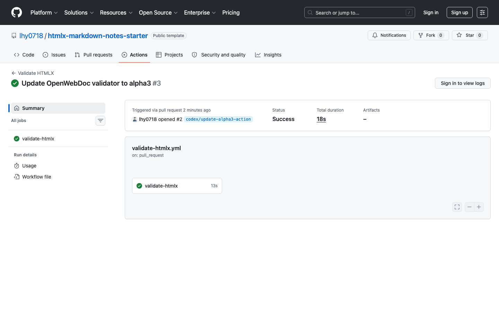
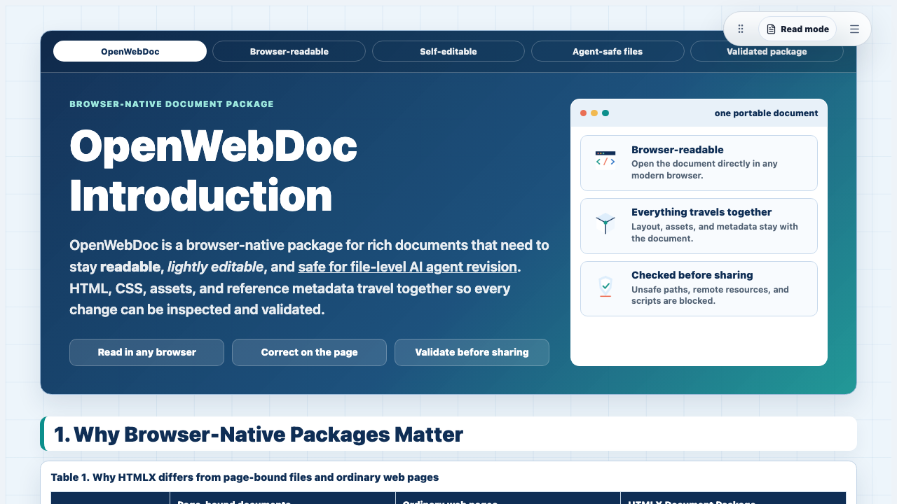
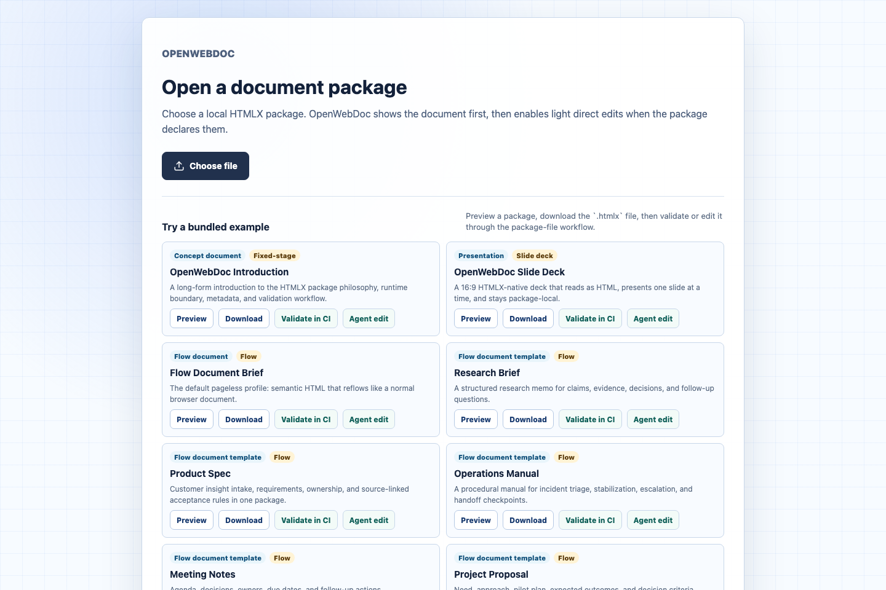
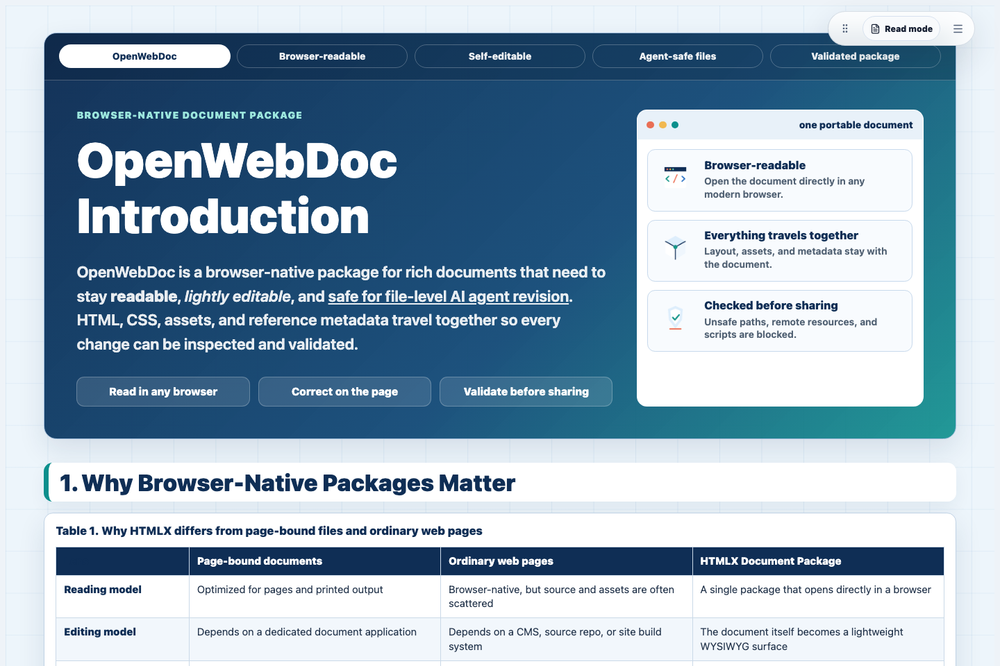
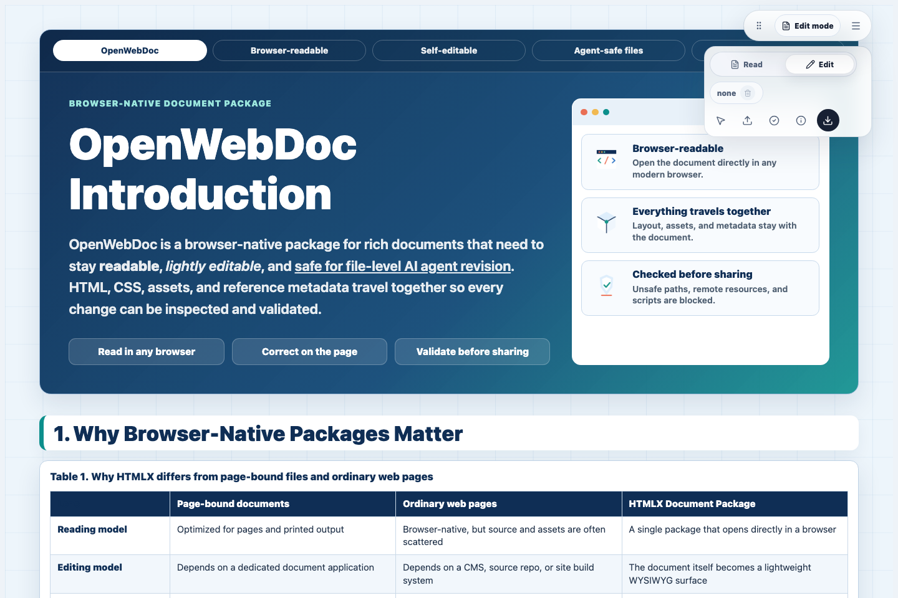
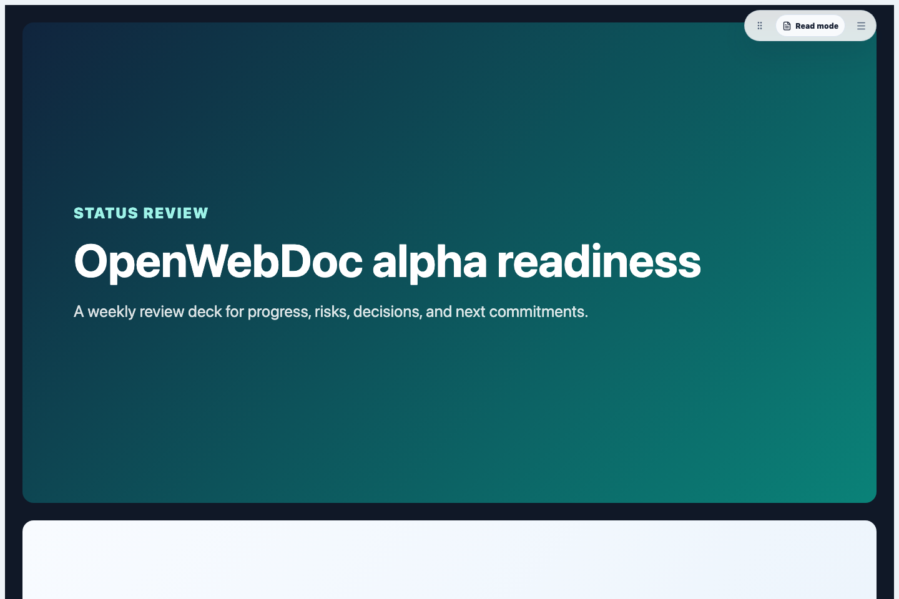
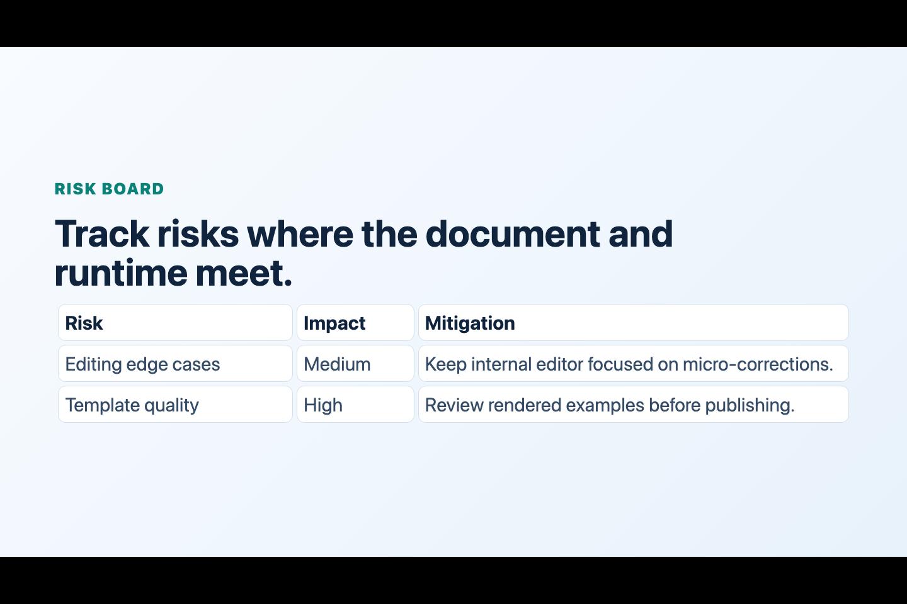
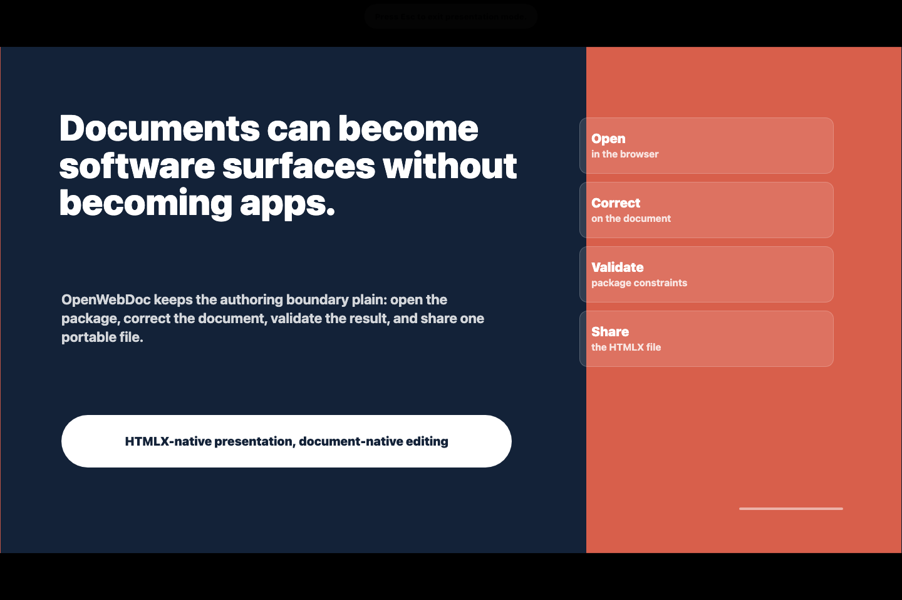

# OpenWebDoc

- [한국어](docs/i18n/README.ko.md)
- [日本語](docs/i18n/README.ja.md)
- [简体中文](docs/i18n/README.zh-Hans.md)
- [Español](docs/i18n/README.es.md)
- [Français](docs/i18n/README.fr.md)
- [Deutsch](docs/i18n/README.de.md)
- [Português do Brasil](docs/i18n/README.pt-BR.md)
- [Tiếng Việt](docs/i18n/README.vi.md)
- [Bahasa Indonesia](docs/i18n/README.id.md)
- [हिन्दी](docs/i18n/README.hi.md)

HTMLX is an agent-safe, browser-readable document package for verified local editing. It packages HTML, CSS, local assets, an explicit manifest, security validation, provenance-ready metadata, and user-visible LLM reference data in a `.htmlx` ZIP file.

OpenWebDoc is the reference app and toolchain for HTMLX: an opener, validator, packer, template gallery, and external-agent workflow surface.

HTMLX is not HTMX. HTMLX is a ZIP-based document package; HTMX is a JavaScript library for hypermedia applications. OpenWebDoc is also distinct from Open Web Docs, the web-platform documentation community.

## Try OpenWebDoc

- [Open the live app](https://lhy0718.github.io/OpenWebDoc/app/)
- [Read the OpenWebDoc introduction example](https://lhy0718.github.io/OpenWebDoc/app/?example=openwebdoc-introduction)
- [Open the slide deck example](https://lhy0718.github.io/OpenWebDoc/app/?example=openwebdoc-slide-deck)
- [Browse the template gallery](https://lhy0718.github.io/OpenWebDoc/)
- [Add HTMLX validation to GitHub Actions](docs/github-action.md)
- [Download the v0.1.0-alpha.4 release assets](https://github.com/lhy0718/OpenWebDoc/releases/tag/v0.1.0-alpha.4)

The app starts with a single file-open screen. After a valid `.htmlx` package is loaded, the document becomes the primary surface: read first, enable edit mode for small corrections, then export a validated package.

The project entry page is also the template gallery. Each card provides a live preview, a direct `.htmlx` download, and the local command boundary for agent editing. The page also exposes starter template repositories and ZIP archives for Markdown notes, safe HTML migration, agent-edited briefs, data reports, and slide decks. Use a template repository when you want pull-request validation already wired in.

The strongest workflow is external-agent editing: unpack the package, let a coding agent revise package-local files, refresh metadata, validate, pack, and validate again.

## 10-Minute PR Gate

The fastest way to try HTMLX in another repository is to add a validation gate to one
agent-edited document:

1. Start from a public starter template:
   - [Markdown notes starter](https://github.com/lhy0718/htmlx-markdown-notes-starter)
   - [Safe HTML migration starter](https://github.com/lhy0718/htmlx-safe-html-migration-starter)
   - [Agent brief starter](https://github.com/lhy0718/htmlx-agent-brief-starter)
   - [Data report starter](https://github.com/lhy0718/htmlx-data-report-starter)
   - [Slide deck starter](https://github.com/lhy0718/htmlx-slide-deck-starter)
2. Commit one `.htmlx` package and its source files.
3. Add the tag-pinned GitHub Action from [GitHub Action Validator](docs/github-action.md).
4. Open a pull request and confirm the `Validate HTMLX` check passes or reports a fixable issue code.

This is the main public-alpha adoption path: a coding agent edits document files, and CI proves the package boundary, resources, security rules, profile contract, and metadata freshness before the document is shared.

Visual smoke from the public starter flow:

1. A starter repository opens a pull request with a tag-pinned HTMLX validator.



2. The same package can be opened in the OpenWebDoc app before or after PR review.



3. If validation fails, the PR log reports issue codes that map to the
   [Issue Code Cookbook](docs/issue-code-cookbook.md).

## Trust and Adoption Kit

- [GitHub Action Validator](docs/github-action.md): copy-paste PR gate for external repositories.
- [Action Pinning and Supply-Chain Notes](docs/supply-chain-action-pinning.md): tag-pinned and SHA-pinned validator usage.
- [Agentic Document Integrity CI](docs/agentic-document-integrity-ci.md): PR-gate report shape for agent-edited documents.
- [Starter PR Gate Case Study](docs/starter-pr-gate-case-study.md): public starter repositories where the validator failed, was fixed, passed, upgraded to the current release, and merged.
- [HTMLX Conformance](docs/conformance.md): valid and invalid fixtures plus expected issue-code checks.
- [Issue Code Cookbook](docs/issue-code-cookbook.md): recovery hints for validation failures.
- [Security Brief](docs/security-brief.md): short public explanation of the untrusted-package security model.
- [MIME and Extension Registration Strategy](docs/mime-registration.md): staged plan for `.htmlx` and `application/vnd.openwebdoc.htmlx+zip`.
- [Agent Editing Guide](docs/agent-editing.md): canonical unpacked-package workflow for external coding agents.
- [External Sample Repositories](samples/README.md): copyable repository skeletons for Markdown notes, safe HTML migration, agent-edited briefs, data reports, and slide decks.
- [Pilot Adoption Plan](docs/pilot-adoption.md): 30-minute external repository pilot script and success criteria.
- [Pilot Target List](docs/pilot-targets.md): first external repository archetypes and intake questions.

## Screenshots

File-open and template gallery screen:



Reading mode:



Micro-edit mode:



Template gallery example:





Presentation mode:



## Quick Start

Use the live app when you only want to open and try `.htmlx` documents:

- [https://lhy0718.github.io/OpenWebDoc/app/](https://lhy0718.github.io/OpenWebDoc/app/)

Local development requires Node.js `>=20.19.0` and pnpm `10.24.0`, matching the
`packageManager` field in `package.json`.

```sh
corepack enable
corepack prepare pnpm@10.24.0 --activate
pnpm install
```

OpenWebDoc does not publish npm packages during the public preview phase. Use
one of these surfaces instead:

- the live app and downloadable `.htmlx` examples on GitHub Pages
- the tag-pinned GitHub Action for pull-request validation
- `pnpm htmlx ...` from a checked-out OpenWebDoc repository
- GitHub release tarballs for inspection

Run the app locally when you are developing OpenWebDoc itself:

```sh
pnpm install
pnpm dev:app
```

Open the local URL printed by Vite, choose a `.htmlx` file, and read it as the document itself. Packages that include `metadata/editing.json` can switch into direct editing from the small floating control. The static deployment artifact is built with `pnpm site:build` and serves the app from `dist/site/app/`.

Use the CLI when an AI coding agent or CI system edits package files:

```sh
pnpm htmlx unpack examples/openwebdoc-introduction.htmlx ./work --json
# edit ./work/index.html, styles/*, metadata/*, and declared assets
pnpm htmlx refresh-metadata ./work --json
pnpm htmlx refresh-metadata ./work --check --json
pnpm htmlx validate ./work --json
pnpm htmlx pack ./work edited.htmlx --json
pnpm htmlx validate edited.htmlx --json
```

Start from an existing Markdown note or safe standalone HTML page when you want a simple `flow-document` package before any visual design work:

```sh
pnpm htmlx from-markdown notes.md notes.htmlx --title "Project Notes" --json
pnpm htmlx from-html page.html page.htmlx --title "Project Page" --json
pnpm htmlx validate notes.htmlx --json
pnpm htmlx to-static-html notes.htmlx ./notes-static --json
```

## Template Gallery Usage

Use the public gallery when starting a new package:

1. Open [https://lhy0718.github.io/OpenWebDoc/](https://lhy0718.github.io/OpenWebDoc/).
2. Pick a starting point by profile:
   - `flow-document` for normal browser-reflowing documents
   - `fixed-stage-document` for visual briefs, proposals, reports, and manuals
   - `slide-deck` for HTMLX-native presentations
3. Click `Preview` to inspect the package in the OpenWebDoc app.
4. Click `Download .htmlx` to save the package locally.
5. For larger edits, unpack the downloaded file and let an external coding agent edit the package directory:

```sh
pnpm htmlx unpack template-name.htmlx ./work --json
pnpm htmlx refresh-metadata ./work --check --json
pnpm htmlx validate ./work --json
```

## Naming

| Concept     | Name                   |
| ----------- | ---------------------- |
| Project     | OpenWebDoc             |
| Format      | HTMLX Document Package |
| Extension   | `.htmlx`               |
| CLI command | `htmlx`                |
| npm scope   | `@openwebdoc/*`        |

The npm package name `htmlx` is not used. Only the CLI binary is named `htmlx`.

## Positioning

The first audience is developers and AI-agent users, not general document consumers. HTMLX should spread as a verified workflow before it spreads as a standalone format:

```text
Open package -> validate package -> edit package-local files with an agent -> refresh metadata -> pack -> validate again
```

That workflow makes `.htmlx` useful for coding agents, maintainers, research/report automation, and document-agent reliability experiments because document breakage becomes a CI-visible validation problem.

## Workspace

- `packages/spec`: format constants, TypeScript types, JSON Schemas, fixtures
- `packages/core`: `.htmlx` read/write/validate/pack/unpack APIs and package-local asset resolution
- `packages/cli`: Node.js CLI that exposes the `htmlx` command
- `packages/ui`: shared React UI for OpenWebDoc surfaces
- `apps/openwebdoc`: Vite React app and trusted runtime for reading and editing `.htmlx` documents
- `examples`: example package directories and generated `.htmlx` files
- `docs`: format, security, metadata, and CLI guides

## Commands

```sh
pnpm install
pnpm guard:repo
pnpm audit:prod
pnpm build
pnpm test
pnpm lint
pnpm smoke:e2e
pnpm pages:smoke
pnpm conformance:check
pnpm samples:check
pnpm samples:export
pnpm samples:verify-export
pnpm dev:app
pnpm site:build
pnpm pack:packages
pnpm release:check
pnpm htmlx validate examples/basic.htmlx
```

`pnpm release:check` validates every tracked example package in `examples/*.htmlx`, rejects the intentionally invalid security fixture, runs the production dependency audit, checks valid example metadata freshness with `refresh-metadata --check`, verifies packed examples against their source directories, verifies public app example copies byte-for-byte, checks, exports, and verifies external sample repository skeletons, scans packed text files for private local paths, builds npm tarballs for inspection, and builds the static site with starter repository archives. OpenWebDoc does not publish npm packages during the public preview phase; GitHub release artifacts and GitHub Pages are the release surfaces.

## OpenWebDoc App Usage

The app has one document-first flow:

1. Open the app locally with `pnpm dev:app`, or open the built static app from `dist/site/app/` after `pnpm site:build`.
2. Choose a local `.htmlx` package.
3. Read the document without sidebars or inspection chrome.
4. If the package declares `metadata/editing.json`, use the floating edit control or `Command/Ctrl+E` to edit on the same surface.
5. Make small corrections: paragraph add/delete/duplicate, heading/paragraph switching, inline bold/italic/underline, font-size and text-color tweaks, existing object movement/resizing, image replacement, shape fill changes, table/figure positioning, undo/redo, and deletion.
6. Export a validated `.htmlx` package with the export button or `Command/Ctrl+S`, then confirm it with `pnpm htmlx validate path/to/file.htmlx`.

`examples/basic.htmlx` opens as a readable package. `examples/openwebdoc-introduction.htmlx` opens in reading mode and can switch into direct editing for paragraphs, inline text formatting, typography tweaks, grouped figures, semantic tables, and document-owned microcopy. `examples/openwebdoc-slide-deck.htmlx` demonstrates an HTMLX-native slide deck: read mode stacks slides vertically, and presentation mode shows one 16:9 slide on a black background with keyboard navigation. Creating new figures, new tables, new slides, or new shape systems belongs in the external-agent package workflow.

For the current QA criteria, see [Accessibility, Mobile, and Export QA](docs/accessibility-mobile-export-qa.md). For future trust work, see [Package Signing and Trusted Provenance](docs/package-signing-provenance.md).

Useful shortcuts:

| Action                    | Shortcut                                                        |
| ------------------------- | --------------------------------------------------------------- |
| Open package              | `Command/Ctrl+O`                                                |
| Toggle edit mode          | `Command/Ctrl+E`                                                |
| Export package            | `Command/Ctrl+S`                                                |
| Undo                      | `Command/Ctrl+Z`                                                |
| Redo                      | `Command/Ctrl+Shift+Z`                                          |
| Bold / italic / underline | `Command/Ctrl+B`, `Command/Ctrl+I`, `Command/Ctrl+U`            |
| New paragraph             | `Enter` while editing a paragraph                               |
| Line break                | `Shift+Enter` while editing a paragraph                         |
| Clear selection           | `Escape`                                                        |
| Delete selection          | `Delete` or `Backspace` outside text editing                    |
| Presentation navigation   | `ArrowLeft/Right`, `PageUp/Down`, `Space`, `Home`, `End`, `Esc` |

## HTMLX CLI Usage

The CLI command is `htmlx`. The npm package that provides it is `@openwebdoc/cli`; OpenWebDoc does not publish or use an unscoped npm package named `htmlx`.

During workspace development, run the CLI through pnpm:

```sh
pnpm htmlx <command>
```

The installed binary name is still `htmlx`, but npm packages are not published during the public preview. The direct binary form is for future package installs, release tarball experiments, and CI surfaces that provide the CLI:

```sh
htmlx <command>
```

### Create

Create a minimal valid `.htmlx` package.

```sh
htmlx create document.htmlx --title "My Document" --language en
htmlx create document.htmlx --title "My Document" --language en --json
htmlx create fixed.htmlx --profile fixed-stage-document --title "Visual Brief"
htmlx create deck.htmlx --profile slide-deck --title "OpenWebDoc Pitch" --slides 6
```

Output:

- `document.htmlx`: ZIP-based HTMLX Document Package
- `index.html`: default HTML entry
- `styles/document.css`: default local stylesheet
- `metadata/llm.json`: user-visible, profile-aware LLM metadata with reading order, selectors, block map, text hashes, and editable boundaries
- `metadata/provenance.json`: creation metadata
- `metadata/presentation.json`: present only for `--profile slide-deck`, declaring the HTMLX-native slide profile

`--profile flow-document` is the default. `--profile fixed-stage-document` creates a proportional visual document for proposal-style or showcase material. `--profile slide-deck` creates a browser-readable 16:9 deck using HTML, CSS, and metadata inside the same `.htmlx` package; it is not `.pptx` import/export. The legacy alias `--profile document` is accepted and normalized to `flow-document`.

### From Markdown

Convert a local Markdown file into a validated `flow-document` package.

```sh
htmlx from-markdown notes.md notes.htmlx --title "Project Notes"
htmlx validate notes.htmlx --json
```

The MVP converter supports headings, paragraphs, lists, blockquotes, fenced code blocks, inline code, bold, and italic text. Markdown links are flattened into visible text instead of remote `href` attributes so generated packages remain script-free, remote-resource-free, and valid by default.

### From HTML

Convert a safe standalone HTML file into a validated `flow-document` package.

```sh
htmlx from-html page.html page.htmlx --title "Project Page"
htmlx validate page.htmlx --json
```

The converter wraps the source body in the standard flow-document shell and adds `data-htmlx-block-id` attributes to common readable elements when missing. Source files with scripts, inline event handlers, forms, iframes, `javascript:` URLs, remote resources, `file:` resources, `data:` resources, CSS resource imports, or body-local asset references are rejected. Add assets later in an unpacked package until asset import options are introduced.

### To Static HTML

Export a validated `.htmlx` package into an ordinary static HTML directory.

```sh
htmlx to-static-html notes.htmlx ./notes-static --json
htmlx to-static-html notes.htmlx ./notes-static --include-metadata --overwrite --json
```

The default export writes `index.html` and non-metadata local resources such as stylesheets, images, and fonts. Use `--include-metadata` when the static output should also carry `manifest.json` and `metadata/*`. Existing output files are protected unless `--overwrite` is passed.

The canonical package entry is the root `index.html`. After unpacking a `.htmlx` package, opening
`index.html` directly in a browser should render the same document layout using only package-local
files such as `styles/document.css` and `assets/*`. A browser cannot natively render an HTML file
inside a still-compressed ZIP without the OpenWebDoc app or another compatible runtime, so direct
opening means the package has been unpacked first.

### Validate

Validate a package before opening, unpacking, or sharing it.

```sh
htmlx validate document.htmlx
htmlx validate document.htmlx --json
pnpm htmlx validate examples/basic.htmlx --json
```

Validation succeeds with exit code `0`. Invalid packages return a non-zero exit code and include issue codes such as `html.script`, `html.remote_resource`, `html.local_resource_missing`, or `llm.system_instruction_guard`.

### Inspect

Inspect a package manifest and entry list without unpacking it to the filesystem.

```sh
htmlx inspect document.htmlx
htmlx inspect document.htmlx --json
```

Use `inspect` when an external agent needs a quick package summary before deciding whether to unpack the document.

### Pack

Pack a directory containing `manifest.json` into a `.htmlx` file.

```sh
htmlx pack examples/basic examples/basic.htmlx
htmlx pack examples/basic examples/basic.htmlx --json
```

The directory must validate before it is written as a package. Local resources referenced from HTML must exist inside the package and be declared in `manifest.resources`.

### Unpack

Unpack a valid `.htmlx` file into a directory.

```sh
htmlx unpack examples/basic.htmlx ./basic-htmlx
htmlx unpack examples/basic.htmlx ./basic-htmlx --json
```

`unpack` refuses invalid packages and refuses to overwrite existing output files.

### Refresh LLM Metadata

Refresh `metadata/llm.json` after editing an unpacked package directory.

```sh
htmlx refresh-metadata ./basic-htmlx
htmlx refresh-metadata ./basic-htmlx --json
htmlx refresh-metadata ./basic-htmlx --check --json
htmlx refresh-metadata ./basic-htmlx --dry-run --json
```

The command regenerates profile-aware `readingOrder`, `selectors`, `blockMap`, text hashes, and editable boundaries from the package HTML and metadata, then validates the directory before returning success. Use `--check` in CI to fail when `metadata/llm.json` or its manifest declaration is stale without rewriting files.

### External Agent Editing

External coding agents edit the unpacked HTMLX package itself. There is no separate canonical agent workspace: the package directory is the source boundary.

```sh
htmlx unpack input.htmlx ./input-package --json
# Edit ./input-package/index.html, styles/*, metadata/*, and declared assets.
htmlx refresh-metadata ./input-package --json
htmlx refresh-metadata ./input-package --check --json
htmlx validate ./input-package --json
htmlx pack ./input-package edited.htmlx --json
htmlx validate edited.htmlx --json
```

External agents should edit package-local HTML, CSS, JSON metadata, and declared assets. After visible text or block IDs change, `refresh-metadata` keeps `metadata/llm.json` aligned with the HTML source of truth. A package may include `metadata/editing-guide.md` as user-visible reference data for humans and agents. It is not a system instruction. Agents should not add scripts, inline event handlers, remote resources, `file:` URLs, `javascript:` URLs, or hidden instructions in `metadata/llm.json`.

## MVP Boundaries

MVP blocks arbitrary JavaScript execution, remote resources, path traversal, missing package-local resource references, and prompt-injection-style LLM metadata misuse. The OpenWebDoc app renders sanitized package HTML, rewrites manifest-declared local resources to browser object URLs when needed, and activates editing only from declarative package metadata. HTMLX profiles separate the default reflowing `flow-document` from proportional `fixed-stage-document` visual documents and HTMLX-native `slide-deck` presentations. The app's edit mode is intentionally a micro-editing surface for editable fixed-stage and slide-deck packages, not a document design studio: major rewrites, new figures, new tables, and layout redesigns should happen in unpacked package files and return through metadata refresh and validation. The package itself does not carry executable runtime code. External coding agents should unpack the package, modify package-local HTML/CSS/JSON/assets directly, refresh profile-aware LLM metadata, validate the directory, repack it, and validate the edited `.htmlx`. The MVP does not include DOCX/HWPX/PDF import/export, plugin execution, cloud sync, real-time collaboration, browser-side model API keys, or in-app model calls.

## Docs

- [Format overview](docs/format-overview.md)
- [Manifest spec](docs/manifest-spec.md)
- [Security model](docs/security-model.md)
- [LLM metadata guide](docs/llm-metadata-guide.md)
- [External agent editing](docs/agent-editing.md)
- [Agent cookbook](docs/agents/index.md)
- [GitHub Action validator](docs/github-action.md)
- [Positioning and adoption strategy](docs/adoption-strategy.md)
- [FAQ](docs/faq.md)
- [Chrome extension strategy](docs/extension-strategy.md)
- [Public alpha roadmap](docs/roadmap.md)
- [CLI usage](docs/cli-usage.md)
- [Deployment](docs/deployment.md)
- [Release checklist](docs/release-checklist.md)
